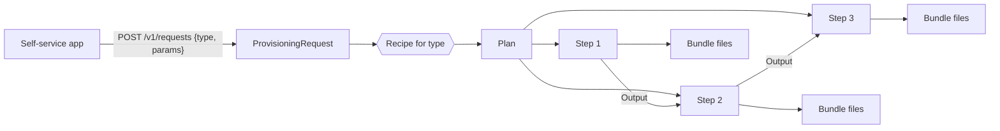
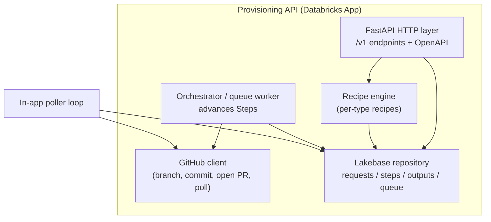
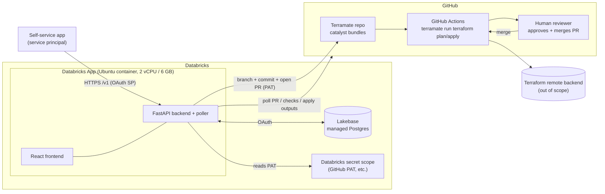
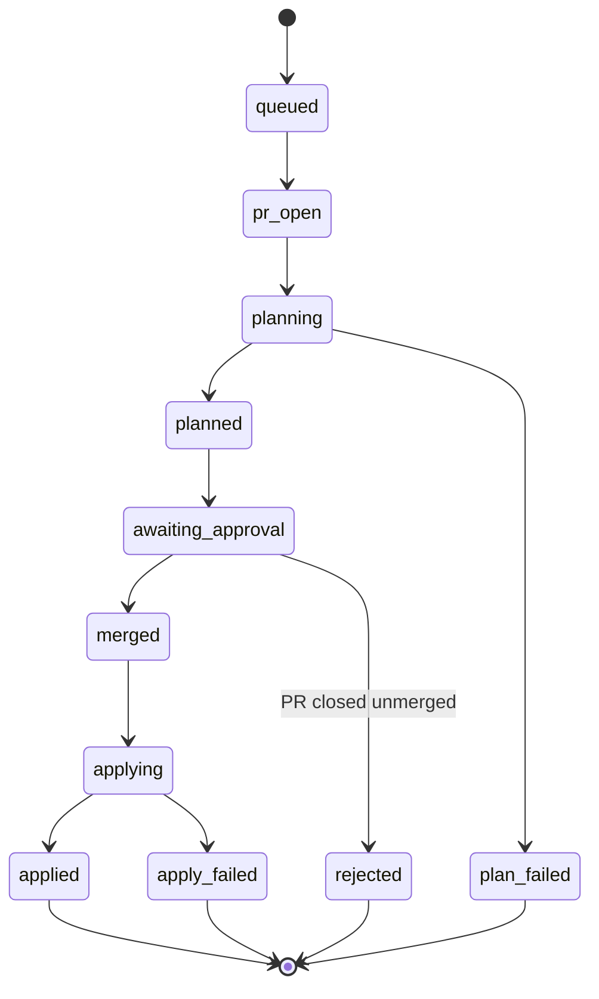

# Architecture Proposal — Terramate Provisioning Abstraction API (v1)

> Status: **Proposal / v1 design**. Decisions here were settled in a wayfinding session; the
> domain model lives in [`CONTEXT.md`](./CONTEXT.md) and the key trade-off in
> [`docs/adr/0001-imperative-recipes-over-declarative-registry.md`](./docs/adr/0001-imperative-recipes-over-declarative-registry.md).
> Open items and out-of-scope work are tracked on the [wayfinder map](https://github.com/TaylorAHanson/terramate-api-wrapper/issues/1).

---

## 1. Purpose & context

We are building a **middle layer** between two systems that must be allowed to change
independently:

- **Self-service application** — an agentic app where users request Databricks rollout
  artifacts (a new workspace, a new catalog, a schema, a service principal, …).
- **Terramate / Terraform codebase** — the IaC repo that actually provisions those
  resources, using Terramate **catalyst bundles** and GitHub Actions.

Today the "tribal knowledge" of turning a request into reality — *clone the repo, edit or
add ~4 bundle YAML files, order the plan/apply operations correctly, and pass outputs from
one apply into the next* — has no home. Baking it into the self-service app couples the app
to Terramate internals; baking it into Terramate couples IaC to the app's request model.

This API is that home. It exposes a small, **versioned** contract to the self-service side
and encapsulates the Terramate interaction behind it, so **either neighbour can change
without breaking the other**.

## 2. Goals & non-goals

**Goals**
- A stable, versioned request contract (`/v1`, `/v2`, …) the self-service app codes against.
- Encapsulate the bundle-editing + ordering "tribal knowledge" in one place.
- Support **ordering with value-passing**: apply A, capture its output, feed it into B.
- Track request/step status and expose the `terraform plan` for review.
- Decouple the three systems so each can evolve on its own cadence.

**Non-goals (v1)**
- The API **does not run Terraform** and **does not manage Terraform state** — the
  Terramate repo's GitHub Actions and its remote backends own execution and state.
- No auto-rollback and no resume-from-failed-step (a failed request halts for a human).
- Not the self-service application itself, and not a redesign of the Terramate repo.

## 3. Design principles

1. **Simple first, not perfect.** Optimise for the smallest thing that works; note the
   scale path rather than pre-building it.
2. **GitOps, not a control plane.** The API's output is a **pull request**. Execution,
   approval, and state stay in the existing Git + Actions workflow.
3. **The API owns ordering; Terramate owns execution.** The sequencing/value-passing that
   the queue exists for is ours; running `terraform` is the repo's CI.
4. **Durable state in Lakebase, nothing on disk.** The app is stateless on the filesystem.

---

## 4. Logical architecture

### 4.1 Domain model



| Term | Meaning |
|---|---|
| **ProvisioningRequest** | One request submitted by the client (`type` + type-specific `params`, **no common envelope**). Expands into exactly one Plan. |
| **Type** | The kind of resource (`workspace`, `catalog`, `schema`, `service_principal`, … — 50+ eventually). `catalog` is just one type, which is why the create endpoint is type-neutral (`/v1/requests`). |
| **Recipe** | The per-type tribal knowledge, **imperative code** (see ADR-0001): which bundle files to edit/add, in what order, and how to build the Plan. |
| **Plan** | The ordered DAG of Steps a request expands into. |
| **Step** | One node of the Plan, realised as **one pull request**. Runs a terraform plan+apply via Actions; may consume earlier Steps' Outputs. |
| **Bundle** | The ~4 Terramate catalyst YAML files edited/added for one resource. |
| **Output** | A value emitted by an applied Step that a later Step consumes. The reason ordering matters. |
| **Version** | A `/vN`, client-selected via URL, pinning *how the API interacts with the Terramate bundles*. |

### 4.2 Components (inside the API)



- **HTTP layer** — validates the request against the type's schema (OpenAPI discriminated
  union on `type`), enforces the `Idempotency-Key`, persists the ProvisioningRequest, returns
  a tracking id. Read endpoints report status and the `terraform plan`.
- **Recipe engine** — resolves the type to its Recipe, produces the Plan of Steps.
- **Orchestrator / queue worker** — pulls the next runnable Step (`SELECT … FOR UPDATE SKIP
  LOCKED`), asks the GitHub client to open its PR, and advances state.
- **GitHub client** — commits bundle edits to a branch and opens the PR; the poller reads PR
  checks / merge status / apply results back.
- **Lakebase repository** — the only durable store: requests, steps, captured outputs, queue.

---

## 5. Physical architecture



**Why these pieces (grounded in the runtime constraints):**

- **Databricks App** hosts FastAPI + React in one long-running container. It has an
  **ephemeral** local filesystem (fine for a throwaway checkout, wiped on redeploy) but no
  durable disk — which is exactly why all state goes to Lakebase.
- **~60 s hard HTTP timeout** at the App's proxy means no long work on the request thread.
  This is *free* for us because the API never runs Terraform — it opens a PR and returns; a
  background **poller** advances long-running Steps.
- **Lakebase (managed Postgres)** is the durable store and the work queue. Standard Postgres
  semantics (`FOR UPDATE SKIP LOCKED`, transactions) make a crash-safe queue trivial.
- **GitHub Actions** in the Terramate repo do all `plan`/`apply`. The API is a client of
  GitHub, not an execution engine.
- **Secrets** (the GitHub service-account PAT, any others) come from a Databricks secret
  scope injected as env vars — never on disk, never in code.

---

## 6. Request lifecycle

One PR per Step, opened strictly in dependency order; the next Step's PR is not opened until
the previous Step is applied and its outputs are captured.

```mermaid
sequenceDiagram
  participant C as Self-service app
  participant A as Provisioning API
  participant DB as Lakebase
  participant G as GitHub (repo + Actions)
  participant H as Human reviewer

  C->>A: POST /v1/requests {type, params} + Idempotency-Key
  A->>A: validate against type schema; resolve Recipe -> Plan
  A->>DB: persist Request + Steps (queued)
  A-->>C: 202 {request_id, status: pending}

  loop for each Step in dependency order
    A->>DB: claim next runnable Step (SKIP LOCKED)
    A->>G: create branch, commit bundle edits, open PR
    A->>DB: Step -> pr_open
    G-->>A: (poll) plan check complete
    A->>DB: Step -> planned  (terraform plan now readable)
    Note over A,H: awaiting_approval
    H->>G: approve + merge PR
    G-->>A: (poll) merged; apply running
    A->>DB: Step -> applying
    G-->>A: (poll) apply complete + outputs (from check-run/PR)
    A->>DB: Step -> applied; store Outputs
  end
  A->>DB: Request -> succeeded
  C->>A: GET /v1/requests/{id}  (status, steps, plans)
```

### 6.1 Ordering & value-passing

The reason a queue exists at all. A later Step's bundle needs a value that only exists after
an earlier Step is **applied** — and an apply only happens when a PR **merges**. So:

1. The API opens Step *k*'s PR, waits for merge + apply.
2. It **pulls** Step *k*'s Terraform outputs from that Actions run (a structured check-run
   output / PR comment in an agreed contract — the API never reads Terraform state).
3. It templates those outputs into Step *k+1*'s bundle files, then opens *k+1*'s PR.

## 7. State model



**Request rollup:** `pending → in_progress → awaiting_approval → succeeded | failed | cancelled`.
Any Step reaching `plan_failed` / `apply_failed` / `rejected` halts the request as `failed`
at that Step; **already-applied Steps stay applied** (no auto-rollback) and a human decides
next.

## 8. Versioning strategy

- A version (`/v1`, `/v2`) is **selected by the client via the URL path** and pins *the way
  the API interacts with the Terramate bundles*.
- When Terramate changes in a way that breaks the interaction, a new `/v(N+1)` is stood up
  with the new interaction logic; **`/vN` keeps serving** until clients migrate and it is
  retired. Multiple versions can run side by side.
- This is the mechanism that lets the **three systems change asynchronously**: a Terramate
  change is absorbed behind a new version rather than forced onto every client at once.
- *Open:* whether a resource created under `/v1` is pinned to `/v1` for later changes
  (**version affinity**) — tied to whether day-2 modifications exist at all. Tracked as fog.

## 9. API surface (v1)

| Method & path | Purpose |
|---|---|
| `POST /v1/requests` | Create a ProvisioningRequest (`{type, params}` + `Idempotency-Key`). Returns `{request_id, status}`. |
| `GET /v1/requests/{id}` | Request status, rollup, and its Steps. |
| `GET /v1/requests/{id}/steps/{n}` | Step detail (PR link, state). |
| `GET /v1/requests/{id}/steps/{n}/plan` | The `terraform plan` for the Step (once `planned`). |
| `POST /v1/requests/{id}/cancel` | Cancel an in-flight request. |
| `GET /v1/health`, `GET /version` | Liveness / build info. |
| `GET /openapi.json`, `/docs` | Self-documenting contract; per-type param schemas as a discriminated union on `type` (this replaces a separate `/types` endpoint). |

## 10. Data model (Lakebase)

Indicative v1 schema — the authoritative design is tracked on the wayfinder map.

- **provisioning_request** — `id`, `type`, `params` (jsonb), `version`, `requester`,
  `idempotency_key` (unique), `status`, timestamps.
- **step** — `id`, `request_id`, `ordinal`, `status`, `pr_number`, `pr_url`,
  `plan_ref`, `depends_on` (step ids), timestamps.
- **output** — `id`, `step_id`, `key`, `value`, captured-at. Consumed by later Steps.
- **Queue** — represented on `step.status` + a claim column; workers pull with
  `SELECT … FOR UPDATE SKIP LOCKED`.

## 11. Security & identity

- **Caller → API:** the self-service app authenticates as its **service principal**
  (Databricks Apps platform auth / M2M OAuth). The API records the requester for audit.
  Caller-level authorization (which SPs may request which types) is fog for v1.
- **API → GitHub:** the API acts as a **GitHub service account** using a **PAT** stored in a
  Databricks secret scope (chosen over a GitHub App for v1 given the enterprise environment;
  a GitHub App is the noted upgrade path for scoped, rotating credentials).
- **API → Lakebase:** OAuth, via the App's injected Lakebase resource credentials.
- **No secrets or state on disk.**

## 12. Alternatives considered (and why not)

| Decision | Chosen | Rejected alternative | Why |
|---|---|---|---|
| Where Terraform runs | **GitHub Actions via a PR** | Run `terramate`/`terraform` in the App or a Databricks Job | Terramate is **CLI-only over a git working tree** (no API/daemon; Terramate Cloud has no public run API). Reusing the repo's existing Actions keeps execution, approval, and state where they already live and work. |
| Long-running work | **Open PR + poll** | In-app background compute for applies | The App has a **~60 s HTTP timeout** and limited compute; Databricks steers long work off the request. With PR+poll there is no long work in the App at all. |
| Type definitions | **Imperative Recipes in code** | Data-driven declarative registry | Per-type git operations vary too much ("edit 2 + add 2, in order" vs "find the right yaml, then edit it") to model declaratively before we've seen enough real recipes. Simple first (ADR-0001). |
| Ordering / value-passing | **API owns it, one PR per Step** | Lean on Terramate's native output-sharing in one run | API ownership is what makes per-Step status and per-Step `terraform plan` visible, and it is the reason the queue exists. |
| Change propagation | **URL-path versioning that pins the bundle interaction** | Single evolving contract | Lets the three systems change asynchronously; a breaking Terramate change becomes a new `/vN` rather than a forced flag-day. |
| Status notifications | **In-app poller** | GitHub webhooks | No inbound endpoint/secret plumbing; matches "simple first". Webhooks are the noted latency/scale upgrade. |
| Failure handling | **Halt, no auto-rollback** | Auto-destroy in reverse | Rollback of partially-applied infra is genuinely hard and risky; a human is better placed to decide. |

## 13. Risks & mitigations

| Risk | Mitigation |
|---|---|
| App redeploy kills an in-flight run | State is in Lakebase; a claimed Step that stalls is re-queued and resumed by the poller. |
| Terramate repo layout changes break Recipes | Absorbed behind a new API version; old versions keep serving. |
| Output-capture contract requires a change on the CI side | Tracked as an explicit cross-team dependency (map ticket); the API only pulls, it does not require inbound access. |
| Human approval is a latency wall between Steps | Inherent to the GitOps/approval model; visible in status as `awaiting_approval`. Auto-merge-per-policy is a fog item. |
| Duplicate provisioning on client retries | `Idempotency-Key` dedupe at `POST`. |

## 14. Open questions (fog) & out of scope

**Open (tracked on the map):** day-2 modifications + version affinity · cross-request
dependencies · batching independent Steps into one PR · webhooks vs poller · caller-level
authorization · GitHub App vs PAT · PR-approval as configurable policy.

**Out of scope:** Terraform execution + state (owned by the repo's Actions/backends) ·
auto-rollback + resume-from-failed-Step · the self-service application · the Terramate repo's
internal design.
