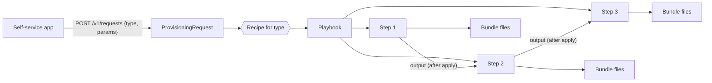
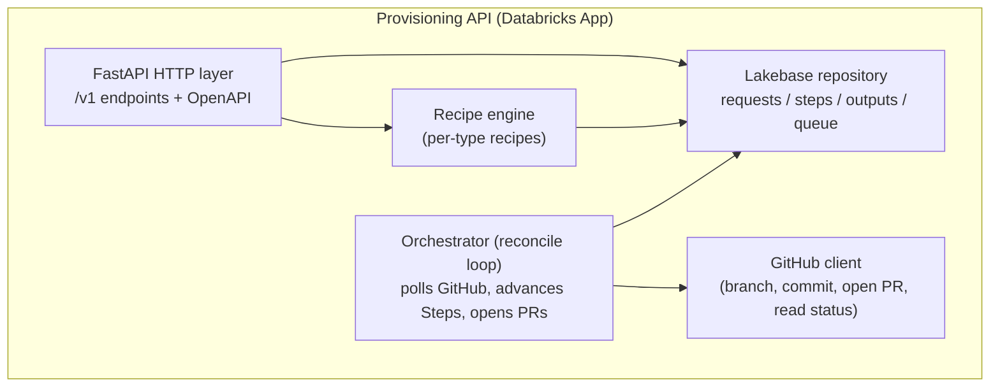
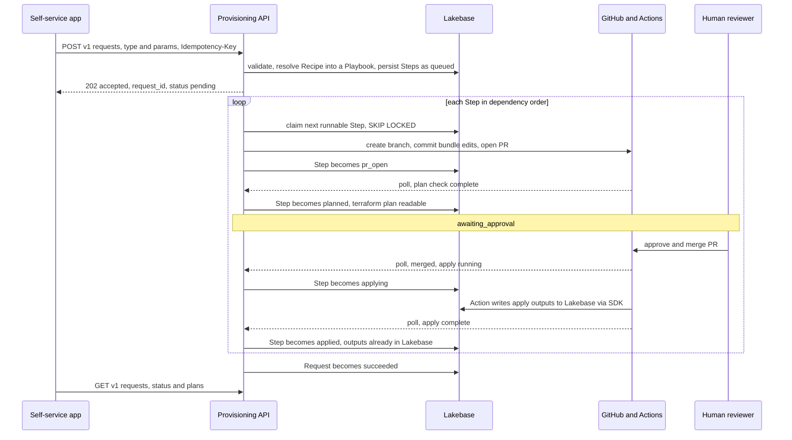
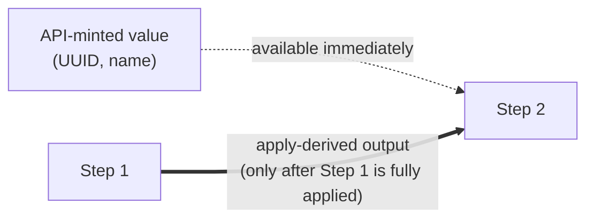
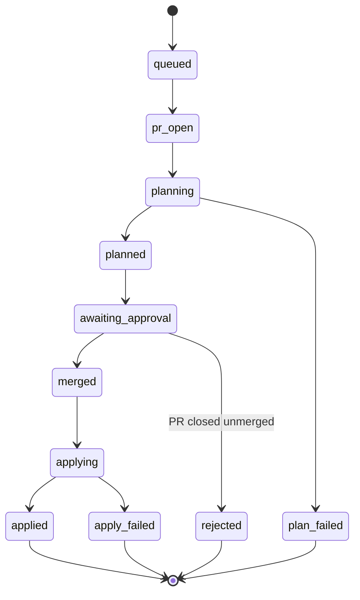
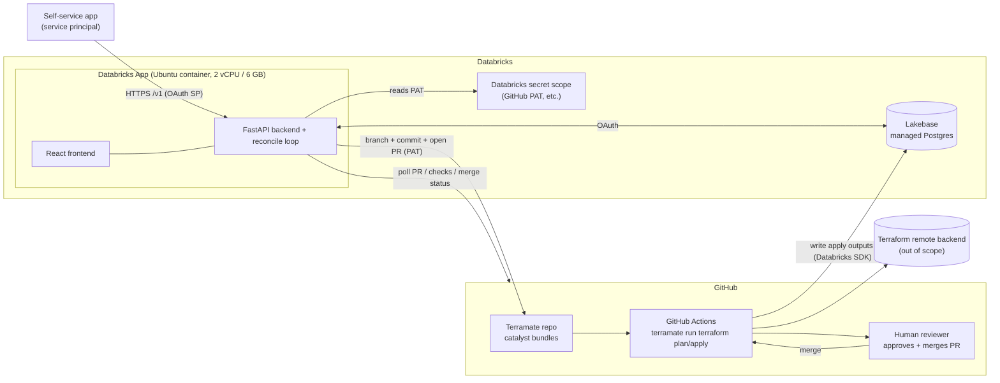

# Architecture Proposal — Terramate Provisioning Abstraction API (v1)

> Status: **Proposal / v1 design**. Decisions here were settled in a wayfinding session; the
> domain model lives in [`CONTEXT.md`](./CONTEXT.md) and the key trade-off in
> [`docs/adr/0001-imperative-recipes-over-declarative-registry.md`](./docs/adr/0001-imperative-recipes-over-declarative-registry.md).
> Open items and out-of-scope work are tracked on the [wayfinder map](https://github.com/TaylorAHanson/terramate-api-wrapper/issues/1).

**In one line:** a versioned API that turns a small self-service request into the right pull
requests against the Terramate repo — encoding the tribal knowledge of *which* bundle files to
edit, *in what order*, passing each apply's outputs into the next — so the self-service app and
the IaC repo can each change without breaking the other.

---

## 1. Purpose & context

We are building a **middle layer** between two systems that must be allowed to change
independently:

- **Self-service application** — an agentic app where users request Databricks rollout
  artifacts (a new workspace, a new catalog, a schema, a service principal, …).
- **Terramate / Terraform codebase** — the IaC repo that actually provisions those
  resources, using Terramate **catalyst bundles** and GitHub Actions.

Today the "tribal knowledge" of turning a request into reality — *clone the repo, edit or
add ~4 bundle YAML files, order the plan/apply operations correctly, and pass outputs from
one apply into the next* — has no home. Baking it into the self-service app couples the app
to Terramate internals; baking it into Terramate couples IaC to the app's request model.

This API is that home. It exposes a small, **versioned** contract to the self-service side
and encapsulates the Terramate interaction behind it, so **either neighbour can change
without breaking the other**.

## 2. The core idea

**The API provisions nothing itself. It writes pull requests; the Terramate repo's existing
GitHub Actions do all the work.**

Given a request, the API resolves the per-type *tribal knowledge* into one or more pull
requests against the Terramate repo — editing or adding the catalyst bundle YAML files. From
there the repo's own pipeline takes over: Actions run `terraform plan`, a human reviews and
merges, Actions run `apply`. The API's only jobs are to **open the PRs in the right order** and
**pass each apply's outputs into the next PR**. It never runs Terraform, never holds Terraform
state, and never needs long-running compute.

Two principles fall straight out of this and are worth stating explicitly:

- **GitOps, not a control plane.** The API's output is a pull request. Execution, approval,
  and state stay in the Git + Actions workflow that already exists and already works.
- **The API owns ordering; Terramate owns execution.** Sequencing and value-passing between
  Steps are ours; running `terraform` is the repo's CI.

**A worked example.** A user requests a workspace. The API resolves the `workspace` Recipe into
a two-step Playbook:

1. **create** — opens a PR that adds the workspace's bundle files. Actions plan it, a human
   merges, Actions apply it. The API captures the resulting `workspace_id`.
2. **bind** — can only run *now*: it needs `workspace_id`, which did not exist until step 1
   applied. The API templates that id into the metastore-binding bundle, opens the second PR,
   and the same plan → merge → apply cycle repeats.

That "step 2 cannot start until step 1 has really applied" is the entire reason the API needs
ordering and a queue. Everything below is machinery in service of it.

## 3. Goals & non-goals

**Goals**
- A stable, versioned request contract (`/v1`, `/v2`, …) the self-service app codes against.
- Encapsulate the bundle-editing + ordering "tribal knowledge" in one place.
- Support **ordering with value-passing**: apply A, capture its output, feed it into B.
- Track request/step status and expose the `terraform plan` for review.
- Decouple the three systems so each can evolve on its own cadence.

**Non-goals (v1)**
- The API **does not run Terraform** and **does not manage Terraform state** (see §2) — the
  Terramate repo's GitHub Actions and its remote backends own execution and state.
- No auto-rollback and no resume-from-failed-step (a failed request halts for a human).
  Recovery leans on **Terraform's own idempotency** — re-applying reconciles safely and won't
  duplicate resources — rather than PR reverts (defense decision). MVP instead invests in
  **pre-flight validation** to catch failures before execution.
- Not the self-service application itself, and not a redesign of the Terramate repo.

---

## 4. Logical architecture

### 4.1 Domain model



| Term | Meaning |
|---|---|
| **ProvisioningRequest** | One request submitted by the client (`type` + type-specific `params`, **no common envelope**). Expands into exactly one Playbook. |
| **Type** | The kind of resource (`workspace`, `catalog`, `schema`, `service_principal`, … — 50+ eventually). `catalog` is just one type, which is why the create endpoint is type-neutral (`/v1/requests`). |
| **Recipe** | The per-type tribal knowledge, **imperative code** (see ADR-0001): a generator `build(params) -> Playbook`, one per type, deployed with the app. Reusable and static — the same Recipe serves every request of its type. |
| **Playbook** | The ordered DAG of Steps a **single** request expands into — the instance a Recipe produces for specific params, persisted and executed. One Recipe (per type) → many Playbooks (one per request). |
| **Step** | One node of the Playbook, realised as **one pull request**. Runs a terraform plan+apply via Actions; may consume earlier Steps' Outputs. |
| **Bundle** | The ~4 Terramate catalyst YAML files edited/added for one resource. |
| **Output** | A value emitted by an applied Step that a later Step consumes. The reason ordering matters. |
| **Version** | A `/vN`, client-selected via URL, pinning *how the API interacts with the Terramate bundles*. |

### 4.2 Components (inside the API)



- **HTTP layer** — validates the request against the type's schema (OpenAPI discriminated
  union on `type`), enforces the `Idempotency-Key`, persists the ProvisioningRequest, returns
  a tracking id. Read endpoints report status and the `terraform plan`.
- **Recipe engine** — resolves the type to its Recipe, produces the Playbook of Steps.
- **Orchestrator (reconcile loop)** — the single background loop; the poller and the queue
  worker are one and the same. On each tick it polls GitHub for in-flight Steps, advances the
  state machine in Lakebase, and — when a Step becomes runnable — claims it (`SELECT … FOR
  UPDATE SKIP LOCKED`) and opens its PR.
- **GitHub client** — the thin adapter the orchestrator uses for all GitHub calls: create a
  branch, commit bundle edits, open the PR, and read back PR checks / merge status / apply
  outputs.
- **Lakebase repository** — the only durable store: requests, steps, captured outputs, queue.

## 5. Request lifecycle

One PR per Step, opened strictly in dependency order; the next Step's PR is not opened until
the previous Step is applied and its outputs are captured. **v1 executes the Playbook serially
even where the DAG would allow independent Steps to run in parallel — batching independent
Steps into fewer PRs is deferred (fog).**



### 5.1 Ordering & value-passing

Two kinds of value feed a Step's bundle, and only one of them forces ordering:

- **API-minted values** (e.g. a UUID, a generated name) — the API computes these up front,
  so they can be templated into *any* Step's bundle immediately. They impose **no** ordering.
- **Apply-derived outputs** (e.g. an id or ARN that only exists once the resource is really
  created) — these are unknown until the earlier Step is **fully applied**. A Step that needs
  one **must wait** for the prior Step's apply to complete before its PR can even be opened.



Mechanically, for an apply-derived dependency:

1. The API opens Step *k*'s PR and polls GitHub for merge + apply status.
2. On apply, Step *k*'s **GitHub Action writes its Terraform outputs directly to Lakebase**
   via the Databricks SDK (an agreed output-capture contract — see
   [ADR-0002](./docs/adr/0002-output-capture-via-direct-lakebase-write.md)). The API never
   reads Terraform state and never parses the run log; outputs are *pushed* to the store, not
   pulled.
3. Once the Action reports apply-complete, the API reads Step *k*'s captured outputs from
   Lakebase and templates them (by **reference**, not by copying values around) into Step
   *k+1*'s bundle files, then opens *k+1*'s PR.

## 6. State model



**Request rollup:** `pending → in_progress → awaiting_approval → succeeded | failed | cancelled`.
Any Step reaching `plan_failed` / `apply_failed` / `rejected` halts the request as `failed`
at that Step; **already-applied Steps stay applied** (no auto-rollback) and a human decides
next.

## 7. Versioning strategy

- A version (`/v1`, `/v2`) is **selected by the client via the URL path** and pins *the way
  the API interacts with the Terramate bundles*.
- When Terramate changes in a way that breaks the interaction, a new `/v(N+1)` is stood up
  with the new interaction logic; **`/vN` keeps serving** until clients migrate and it is
  retired. Multiple versions can run side by side.
- This is the mechanism that lets the **three systems change asynchronously**: a Terramate
  change is absorbed behind a new version rather than forced onto every client at once.
- **Standard (defense decision): no breaking changes — only new versions with a deprecation
  timeline.** Changes within a version are additive; anything breaking becomes a new `/vN`,
  and old versions retire on an announced schedule.
- Where possible, align API versions to **Terramate's own bundle-versioning** concept rather
  than inventing a parallel scheme (research on the map, #3).
- A **change-management process** — how new versions / deprecations / breaking-avoidance are
  communicated to the self-service side — is needed and tracked on the map.
- *Open:* whether a resource created under `/v1` is pinned to `/v1` for later changes
  (**version affinity**) — tied to whether day-2 modifications exist at all. Tracked as fog.

---

## 8. Physical architecture



**Why these pieces (grounded in the runtime constraints):**

- **Databricks App** hosts FastAPI + React in one long-running container. It has an
  **ephemeral** local filesystem (fine for a throwaway checkout, wiped on redeploy) but no
  durable disk — which is exactly why all state goes to Lakebase.
- **~60 s hard HTTP timeout** at the App's proxy means no long work on the request thread.
  This is *free* for us because the API never runs Terraform — it opens a PR and returns; a
  background **poller** advances long-running Steps.
- **Lakebase (managed Postgres)** is the durable store and the work queue. Standard Postgres
  semantics (`FOR UPDATE SKIP LOCKED`, transactions) make a crash-safe queue trivial.
- **GitHub Actions** in the Terramate repo do all `plan`/`apply`. The API is a client of
  GitHub, not an execution engine. On apply, the Action **writes the Step's Terraform outputs
  straight to Lakebase via the Databricks SDK** (ADR-0002) — so the API polls GitHub only for
  *status* (PR/checks/merge), never for output values, and still exposes no inbound endpoint.
- **Secrets** (the GitHub service-account PAT, the Action's Lakebase write credential, any
  others) come from a Databricks secret scope injected as env vars — never on disk, never in
  code.

## 9. Data model (Lakebase)

Indicative v1 schema — the authoritative design is tracked on the wayfinder map.

- **provisioning_request** — `id`, `type`, `params` (jsonb), `version`, `requester`,
  `idempotency_key` (unique), `status`, timestamps.
- **step** — `id`, `request_id`, `ordinal`, `status`, `pr_number`, `pr_url`,
  `plan_ref`, `depends_on` (step ids), timestamps.
- **output** — `id`, `step_id`, `key`, `value`, captured-at. **Written directly by the Step's
  GitHub Action via the Databricks SDK** (ADR-0002), then referenced by later Steps. (SCD2
  history under consideration — see #6.)
- **Queue** — represented on `step.status` + a claim column; workers pull with
  `SELECT … FOR UPDATE SKIP LOCKED`.

## 10. Security & identity

- **Caller → API:** the self-service app authenticates as its **service principal**
  (Databricks Apps platform auth / M2M OAuth). The API records the requester for audit.
  Caller-level authorization (which SPs may request which types) is fog for v1.
- **API → GitHub:** the API acts as a **GitHub service account** using a **PAT** stored in a
  Databricks secret scope (chosen over a GitHub App for v1 given the enterprise environment;
  a GitHub App is the noted upgrade path for scoped, rotating credentials).
- **API → Lakebase:** OAuth, via the App's injected Lakebase resource credentials.
- **No secrets or state on disk.**

**Identity & operational controls (defense decisions, detail on the map):**

- **Asset identity (proposed):** a deterministic **UUIDv5** derived from business/domain
  attributes as the durable, recreatable asset identifier — distinct from the client-supplied
  **UUIDv4 `Idempotency-Key`**. It encodes domain/business/logical info so the same asset maps
  to the same id across systems. *Open:* whether those encoding inputs are always known up
  front. Naming/domain definition tracked on the map.
- **Duplicate handling:** exact-duplicate prevention is the `Idempotency-Key`; **fuzzy
  "a similar request already exists"** (by domain/recency) is **pushed left to the self-service
  agent**, which is better placed to judge and avoids the API leaking cross-team info.
- **Global off-switch:** an admin control that disables new-request intake for the whole system
  (e.g. while Terramate itself is changing) while in-flight Steps drain — possibly a
  "sandbox-only" mode. Design tracked on the map.

## 11. API surface (v1)

| Method & path | Purpose |
|---|---|
| `POST /v1/requests` | Create a ProvisioningRequest (`{type, params}` + `Idempotency-Key`). Returns `{request_id, status}`. |
| `GET /v1/requests/{id}` | Request status, rollup, and its Steps. |
| `GET /v1/requests/{id}/steps/{n}` | Step detail (PR link, state). |
| `GET /v1/requests/{id}/steps/{n}/plan` | The `terraform plan` for the Step (once `planned`). |
| `POST /v1/requests/{id}/cancel` | Cancel an in-flight request. |
| `GET /v1/health`, `GET /version` | Liveness / build info. |
| `GET /openapi.json`, `/docs` | Self-documenting contract; per-type param schemas as a discriminated union on `type` (this replaces a separate `/types` endpoint). |

---

## 12. Alternatives considered (and why not)

| Decision | Chosen | Rejected alternative | Why |
|---|---|---|---|
| Where Terraform runs | **GitHub Actions via a PR** | Run `terramate`/`terraform` in the App or a Databricks Job | Terramate is **CLI-only over a git working tree** (no API/daemon; Terramate Cloud has no public run API). Reusing the repo's existing Actions keeps execution, approval, and state where they already live and work. |
| Long-running work | **Open PR + poll** | In-app background compute for applies | The App has a **~60 s HTTP timeout** and limited compute; Databricks steers long work off the request. With PR+poll there is no long work in the App at all. |
| Type definitions | **Imperative Recipes in code** | Data-driven declarative registry | Per-type git operations vary too much ("edit 2 + add 2, in order" vs "find the right yaml, then edit it") to model declaratively before we've seen enough real recipes. Simple first (ADR-0001). |
| Ordering / value-passing | **API owns it, one PR per Step** | Lean on Terramate's native output-sharing in one run | API ownership is what makes per-Step status and per-Step `terraform plan` visible. |
| Output capture | **GitHub Action writes outputs directly to Lakebase (SDK)** | API polls the Actions run / a PR comment, or the Action POSTs to an API endpoint | Direct write is the simplest reliable path — no parsing run logs or check-runs, no inbound API endpoint, and Terramate's native output-sharing is undocumented. Chosen at the architecture defense ([ADR-0002](./docs/adr/0002-output-capture-via-direct-lakebase-write.md)). |
| Change propagation | **URL-path versioning that pins the bundle interaction** | Single evolving contract | Lets the three systems change asynchronously; a breaking Terramate change becomes a new `/vN` rather than a forced flag-day. |
| Status notifications | **In-app poller (status only)** | GitHub webhooks | No inbound endpoint/secret plumbing; matches "simple first". (Output *values* arrive via the Action's direct Lakebase write, above; the poller only reads PR/check/merge status.) Webhooks are the noted latency/scale upgrade. |
| Failure handling | **Halt, no auto-rollback** | Auto-destroy in reverse | Rollback of partially-applied infra is genuinely hard and risky; a human is better placed to decide. |

## 13. Build effort & schedule risk (what's easy, what's hard)

We are building with **agentic coding**, so producing the code is fast — writing endpoints,
schemas, a queue, a state machine, a GitHub client is well-trodden ground. The schedule risk
is **not typing speed**; it's the unknowns, the integrations, and the cross-team
dependencies that no coding assistant can resolve for us.

**Easy — agentic coding compresses these to days, not weeks:**

- FastAPI `/v1` surface, Pydantic models, and the OpenAPI discriminated-union type schemas.
- React frontend: submit a request, watch status, read the `terraform plan`.
- Lakebase schema + repository + queue (`FOR UPDATE SKIP LOCKED`) + the Step/Request
  state-machine transitions.
- GitHub client: branch, commit via the Git Data API, open PR, read checks/merge/outputs.
- The reconcile-loop skeleton and `Idempotency-Key` dedupe.
- Databricks App packaging (`app.yaml`, secret-scope wiring, the Lakebase resource).

**Hard — this is where the calendar actually goes:**

| Area | Why it's hard | What gates / de-risks it |
|---|---|---|
| **Recipe tribal knowledge per type** | The real per-type bundle edits ("edit 2 + add 2, in order"; "find the right yaml") can't be guessed and live outside the code. **The long pole.** | Bundle examples ([#2](https://github.com/TaylorAHanson/terramate-api-wrapper/issues/2)) + the Recipe interface ([#5](https://github.com/TaylorAHanson/terramate-api-wrapper/issues/5)); iterate with the platform team. |
| **Action → Lakebase output write** | *Mechanism* is decided (Action writes outputs to Lakebase via the Databricks SDK, ADR-0002), but it still needs a change in *another* repo's CI, a Lakebase write credential for the Action, and agreement on the row shape (+ SCD2?). Coordination time, not coding time. | [#6](https://github.com/TaylorAHanson/terramate-api-wrapper/issues/6); start it early, in parallel with the build. |
| **Partial-apply failure reality** | "Halt, no rollback" is easy to state but messy to operate — what a human does next, drift, resume. | Accepted for v1; resume/rollback is fog. |
| **Environment friction (enterprise-slow, airgapped)** | GH Service-account PAT, secret scopes, App→GitHub egress, and prod approval all take real calendar time. | Front-load the access/provisioning asks. |

**Bottom line:** the code is a few days; the **tribal-knowledge encoding, the cross-repo
output contract, and the enterprise access/provisioning** are where a proposal like this
slips. 

## 14. Runtime risks & mitigations

Operational failure modes once it's running (distinct from the build/schedule risk in §13).

| Risk | Mitigation |
|---|---|
| App redeploy kills an in-flight run | State is in Lakebase; a claimed Step that stalls is re-queued and resumed by the reconcile loop. |
| Terramate repo layout changes break Recipes | Absorbed behind a new API version; old versions keep serving. |
| Human approval is a latency wall between Steps | Inherent to the GitOps/approval model; visible in status as `awaiting_approval`. Auto-merge-per-policy is a fog item. |
| Duplicate provisioning on client retries | `Idempotency-Key` dedupe at `POST`. Fuzzy "similar request already exists" is pushed left to the self-service agent (defense decision). |
| GitHub treated as strongly consistent | Reconcile from PR/Actions truth on every tick; tolerate re-runs and delayed checks. |
| Action fails to write outputs to Lakebase (or writes partial) | A Step is not marked `applied` until its expected outputs are present in Lakebase; a missing/partial write holds the Step for a human rather than opening the next PR with a blank reference. |

---

## 15. How to build a Recipe (MVP and future)

A **Recipe** is the imperative, per-type unit (see [ADR-0001](./docs/adr/0001-imperative-recipes-over-declarative-registry.md)).
It turns validated `params` into (a) the **bundle file mutations** and (b) an **ordered Playbook
of Steps** with the output wiring between them. The interface itself is a design task
([#5](https://github.com/TaylorAHanson/terramate-api-wrapper/issues/5)); this section is the
intended shape.

### 15.1 MVP

- **Interface:** `build(params) -> Playbook`, where a `Playbook` is an ordered list of `StepSpec`.
- **StepSpec:** `{ key, bundle_edits: [FileEdit], depends_on: [step keys], consumes: [OutputRef], produces: [output names], preflight: [Check], postflight: [Check] }`.
- **Preflight / postflight checks** are **first-class `StepSpec` properties** (defense
  decision). A **preflight** runs *before* the Step's PR is opened and can fail — or skip — the
  Step early: e.g. *is a CIDR range available?*, *does this resource already exist so we can
  skip creating it?* (possibly via Databricks SDK / MCP lookups). A **postflight** validates
  *after* apply. Defining the check framework is a map ticket.
- **FileEdit:** `AddFile(path, content)` or `EditFile(path, yaml_patch)`. Prefer a
  **structured YAML patch** (parse → mutate → serialize) over text munging — safer and
  reviewable in the PR diff.
- **Output wiring:** a StepSpec references an earlier Step's *apply-derived* output with a
  placeholder like `${steps.<key>.outputs.<name>}`; the reconcile loop resolves placeholders
  from captured Outputs *before* opening that Step's PR. API-minted values (UUID, name) are
  resolved up front (see §5.1).
- **Registry:** `RECIPES: dict[type, Recipe]`; adding a type = a new Recipe + a Pydantic
  param model registered in the OpenAPI discriminated union. (This deploy-per-type cost is
  the trade-off accepted in ADR-0001.)
- **Commit path:** bundle edits are pushed via the GitHub Git Data API (blob → tree → commit
  → ref) — no local checkout, no filesystem.

A sketch (illustrative pseudo-Python) for the `workspace` recipe — "edit 2 yamls, add 2, in
order":

```python
class WorkspaceRecipe(Recipe):
    type = "workspace"

    def build(self, p: WorkspaceParams) -> Playbook:
        return Playbook([
            StepSpec(
                key="create",
                bundle_edits=[
                    AddFile(f"stacks/workspaces/{p.name}/stack.tm.hcl", render_stack(p)),
                    AddFile(f"stacks/workspaces/{p.name}/inputs.yaml", render_inputs(p)),
                ],
                produces=["workspace_id"],          # apply-derived
            ),
            StepSpec(
                key="bind",
                depends_on=["create"],
                consumes=[OutputRef("create", "workspace_id")],
                bundle_edits=[
                    # "find the right yaml, then edit it"
                    EditFile(locate_metastore_binding(p.metastore),
                             bind_workspace_patch("${steps.create.outputs.workspace_id}",
                                                   p.groups)),
                    EditFile(f"stacks/workspaces/{p.name}/inputs.yaml",
                             set_owner_patch(p.domain_owner)),
                ],
            ),
        ])
```

The reconcile loop opens the `create` PR, waits for merge + apply, captures `workspace_id`,
resolves the placeholder into the `bind` bundle, then opens the `bind` PR.

A contrasting sketch for the `schema` recipe — the pure "find the right catalog, then add the
schema to it" case. It is a **single Step**: the catalog already exists, so nothing has to be
applied first, there is no apply-derived Output to wait on, and every value is API-known up
front (see §5.1). This is the whole reason a Recipe is imperative code — locating *which*
catalog yaml to touch is a lookup, not a template:

```python
class SchemaRecipe(Recipe):
    type = "schema"

    def build(self, p: SchemaParams) -> Playbook:
        # "find the right catalog" — a lookup against existing repo content
        catalog_file = locate_catalog(p.catalog)   # raises if the catalog isn't found
        return Playbook([
            StepSpec(
                key="add-schema",
                bundle_edits=[
                    EditFile(catalog_file, add_schema_patch(p.name, p.owner, p.comment)),
                ],
                # no depends_on, no consumes, no produces — one PR, no value-passing
            ),
        ])
```

The reconcile loop opens the single `add-schema` PR and the request succeeds once it is merged
and applied — no waiting on an earlier Step, because there isn't one.

**What's ours vs. what the framework gives us.** The sketches lean on two layers. `Playbook`,
`StepSpec`, `AddFile`, `EditFile`, and `OutputRef` are the **Recipe framework** — the interface
from the bullets above, provided once and used by every recipe. Everything else — the
`render_*`, `locate_*`, and `*_patch` calls — is **code we write per type**, and it factors
into three kinds:

- **Renderers — `render_*`** (e.g. `render_stack`, `render_inputs`): build the full contents
  of a *new* file from `params`. Paired with `AddFile`.
- **Locators — `locate_*`** (e.g. `locate_catalog`, `locate_metastore_binding`): the "find the
  right yaml" lookups against existing repo content; return the path to edit and raise if it's
  missing.
- **Patchers — `*_patch`** (e.g. `add_schema_patch`, `bind_workspace_patch`, `set_owner_patch`):
  compute a structured YAML mutation for an *existing* file. Paired with `EditFile`.

These custom helpers are the seeds of the shared helper library noted in §15.2: the first few
recipes write them inline; the common shape gets extracted once enough recipes reveal it.

### 15.2 Future possibilities

- **A helper library** as recipes accrete: a YAML-patch toolkit, a "locate the right file"
  resolver, shared naming/tagging conventions — the common shape ADR-0001 is waiting to see.
- **Golden-file test harness** against a fixture terramate repo: given `params`, assert the
  expected file diffs and Playbook — the way to gain confidence while airgapped.
- **Dry-run / preview:** render the bundle diff and the Playbook without opening any PR.
- **Declarative layer for the simple recipes** once a stable shape emerges (the ADR-0001
  revisit trigger) — hybrid: declarative for the common 80%, code escape-hatch for the rest.
- **Recipe composition:** a "project" recipe that reuses the workspace + catalog + schema
  recipes as sub-plans.
- **Agentic recipe authoring:** feed a before/after bundle diff from the platform team and
  scaffold a candidate Recipe for human review — turning tribal knowledge into a recipe fast.
- **Policy hooks:** validate `params` against org policy before planning.
- **Recipe versioning** aligned to the API version (part of [#3](https://github.com/TaylorAHanson/terramate-api-wrapper/issues/3)).

## 16. Open questions (fog) & out of scope

**Open (tracked on the map):** day-2 modifications + version affinity · cross-request
dependencies · batching independent Steps into one PR · webhooks vs poller · caller-level
authorization · GitHub App vs PAT · PR-approval as configurable policy.

**Out of scope:** Terraform execution + state (owned by the repo's Actions/backends) ·
auto-rollback + resume-from-failed-Step · the self-service application · the Terramate repo's
internal design.

## 17. Discussion (defense meeting — raw notes)

> Captured at the architecture-defense meeting; full summary in
> [`arch_defense_meeting_notes.text`](./arch_defense_meeting_notes.text). The decisions below
> have been **reconciled into the sections above** — output capture → §5 / §8 / §12 /
> [ADR-0002](./docs/adr/0002-output-capture-via-direct-lakebase-write.md); versioning standard
> → §7; preflight/postflight → §15.1; asset identity, dedupe, off-switch → §10; recovery →
> §3 — and into the [wayfinder map](https://github.com/TaylorAHanson/terramate-api-wrapper/issues/1)
> as new tickets and fog. The raw notes are kept here as the source log.

### 2 Failure Modes
- Compile time -  
  - Introduce Pre-flight request checks as part of StepSpec()
  - __Example: Check availability of CIDR ranges__
  - Consider that some things may already be created and not needed to be created (perhaps this is further left, Databricks SDK / MCP calls )
- Run time
**Key Decision:** Should we do a PR revert? **No.** Rely on Terraform idempotency.

### Locking 
**Consider:** If you are doing some kind of edit where you need set the target into "just me" mode so concurrent edits don't blow it up, 
- Option 1: Add as first class property of StepSpec
- Option 2: Simple, nuclear, "LOCK ALL" for a given playbook
- Both

**Consider:** What if terraform itself changes while the resource is being created/edited?
- "Sandbox Only" mode as well? 
- API stays live for requests while the stuff right of a playbook is off? 
- Consider 20X instead of 202 to RESTfully expose the delay
- Terramate itself has bundle versioning concept, consider tieing these together to API versioning
- Set architecture standard: NO breaking changes, only new versions w/ deprecation timeline
**Key Decision:** Off button for the system as a whole.

### Dupllicate Requests
**Consider:** Team disucsses "we need a new catalog". 2 people in that team put in the request right after that meeting. 
- "similar request exists" functionality? Dedupe by domain, recentness.  
- Security concerns - don't leak info
**Key Decision:** Push Left, good job for an agent

### Consider UUID**v5** for a unique asset identifier and use that as the idempotency key (which would have UUIDv4). 
This gives us a more durable, recreatable ID to use across the system. 
Encodes Domains, business, logical info
**Consider** Do we have this info upfront always? 
Reference: 
```
- **HTTP layer** — validates the request against the type's schema (OpenAPI discriminated
  union on `type`), enforces the `Idempotency-Key`, persists the ProvisioningRequest, returns
  a tracking id. Read endpoints report status and the `terraform plan`.
```

### Change Management Process
We need some way of communicating new versions, deprecations, changes to SSC. 

### Persist Console Output
Step 1 > Terramate Apply > console output (to be used in step 2) > [solution] > step 2
Referring to "Terramate's (undocumented) native output-sharing"
Options
- API polls Github Actions output
- API polls Github PR (comment? Text body)
- Github Actions POST to API
**- Direct write to Lakebase via sdk**
Decision: **Direct write from GH action to Lakebase via sdk** SCD 2?
Future consideration: Consider threading this into restfull endpoints to expose status so an agent could reason over it and suggest what to do next in various unhandled failure modes

### Nomenclature
- *Preflight* and *postflight* checks should be first class properties of StepSpec. Define as a concept.
- The UUIDv5 needs to have a name/ domain definintion

### UI
Add a as a future feature