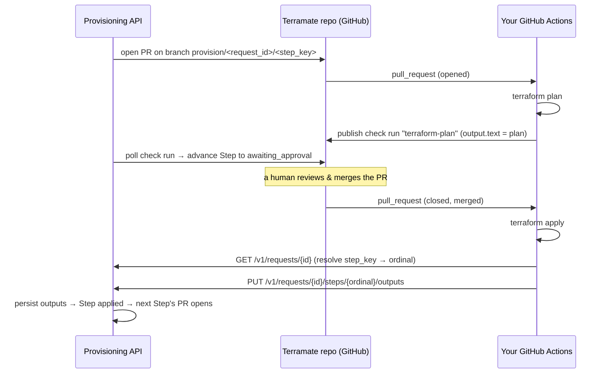

# CI integration contract — Terramate repo ↔ Provisioning API (ADR-0003)

**Audience:** whoever owns the Terramate repo and writes its GitHub Actions CI.
**Purpose:** the exact, minimal contract your CI must satisfy so the provisioning
API (`terramate-api-wrapper`) can drive it end to end.

The single most important boundary: **the provisioning API never runs Terraform.**
It opens pull requests against your repo and reads back status; **your CI** runs
`terraform plan`/`apply`, and **your CI reports results back to the API over
HTTP** (ADR-0003). The API is the sole writer of its own database — your CI needs
only a scoped API credential, never a database credential.

A working, minimal reference implementation lives in
[`fixtures/terraform-fixture-repo/`](../fixtures/terraform-fixture-repo/) —
`.github/workflows/terraform.yml` + `scripts/report_outputs.py` (trivial
`random_id`/`local_file` Terraform, no cloud). Copy its shape.

---

## The loop



---

## 1. Branch naming (API → you)

The API opens **one PR per Step**, from a branch named exactly:

```
provision/<request_id>/<step_key>
```

- `<request_id>` — a UUID.
- `<step_key>` — e.g. `create`, `bind`.

This branch name is the **only** context your CI has about which Step it is
acting on, so parse it from the PR head ref. Bundle file edits are already
committed on the branch; the PR targets `main`.

## 2. Plan (on PR `opened` / `synchronize` / `reopened`)

Run `terraform plan` and publish a **GitHub check run**:

- **name:** `terraform-plan` (exact — the API matches on this)
- **head_sha:** the PR head sha
- **status:** `completed`
- **output.text:** the human-readable plan (the API surfaces this verbatim via
  `GET .../steps/{n}/plan`; keep it under ~65 KB)

The API polls this check run and moves the Step from `pr_open` to
`awaiting_approval` once it is `completed`. No plan check run ⇒ the Step waits.

## 3. Apply + report (on PR `closed` with `merged == true`)

1. Check out the **merge commit** and run `terraform apply`.
2. Parse `request_id` + `step_key` from the PR head branch.
3. Resolve `step_key → ordinal`: `GET /v1/requests/{request_id}` and find the
   entry in `steps[]` whose `key` matches (the report endpoint is
   ordinal-scoped).
4. Report the result (next section).

---

## The report endpoint (the core contract)

```
PUT /v1/requests/{request_id}/steps/{ordinal}/outputs
Content-Type: application/json
Authorization: Bearer <token>   # see Auth below
```

**Body:**

```json
{
  "applied": true,
  "outputs": { "workspace_id": "1234567890" },
  "tf_console": "Apply complete! Resources: 1 added, 0 changed, 0 destroyed."
}
```

| Field | Meaning |
|---|---|
| `applied` | `true` if `terraform apply` succeeded, `false` if it failed. |
| `outputs` | Apply-derived values, **keyed by the output names the Step declares** (see "Output names" below). JSON-serializable values. Send `{}` when the Step produces none. |
| `tf_console` | Raw apply console text. **Always send it**, success or failure — it is stored for humans regardless. |

**Responses:**

| Status | Meaning / your action |
|---|---|
| `200` | Recorded. Body: `{ "ordinal", "key", "status" }` — the Step's resulting status. |
| `401` | No trusted forwarded identity — your auth token didn't resolve. Fix auth. |
| `403` | Identity resolved but not on the API's `CI_PRINCIPALS` allowlist. Ask the API operator to add your service principal. |
| `404` | Unknown `request_id` or `ordinal`. |
| `409` | The Step isn't in a reportable state (only `applying`, `applied`, `apply_failed` accept a report). Usually means the PR wasn't merged as the API expected, or you're reporting the wrong Step. |

**Idempotent:** retrying an identical report is a no-op — safe to retry on
transient network failure.

### Output names (the coupling that matters most)

The `outputs` keys **must match the names the Step is expected to produce**, because a
later Step consumes them by reference (e.g. `${steps.create.outputs.workspace_id}`).
Each Recipe defines these. For the current `workspace` Recipe:

| Step key | Must emit outputs |
|---|---|
| `create` | `workspace_id` |
| `bind` | *(none)* |

If a Step's expected output names are missing from your report, the API holds
the Step at `applying` (waiting for the rest) and flags it `stuck` after a
timeout — the dependent Step's PR never opens. Get the names right.

---

## Auth (M2M service principal)

The API is deployed as a **Databricks App**, behind the Databricks Apps OAuth
proxy. Your CI authenticates as a **Databricks service principal**:

1. Mint a workspace OAuth token with the SP's client-credentials grant:
   ```
   POST {DATABRICKS_HOST}/oidc/v1/token
   Authorization: Basic base64(client_id:client_secret)
   Content-Type: application/x-www-form-urlencoded
   grant_type=client_credentials&scope=all-apis
   ```
   → `access_token`.
2. Send it as `Authorization: Bearer <access_token>` on **both** the `GET` and
   the `PUT`.

The proxy authenticates the token and stamps the SP's identity onto the
`X-Forwarded-User` header before the request reaches the app; the API checks
that identity against its `CI_PRINCIPALS` allowlist. So the API operator must:

- grant your SP **can use** on the App, and
- add your SP's forwarded identity to `CI_PRINCIPALS`.

You never set `X-Forwarded-*` yourself — the proxy owns those and overwrites any
you send. Store `client_id`/`client_secret` as CI secrets.

---

## Failure semantics

- **Apply failed:** report `{"applied": false, "outputs": {}, "tf_console": "..."}`.
  The Step moves to `apply_failed` and the whole request fails (halt, no
  rollback) — already-applied Steps stay applied; nothing further is attempted.
- **No report / missing outputs:** the Step stays at `applying` and is flagged
  `stuck` after `STEP_STUCK_THRESHOLD_SECONDS`, surfaced to an operator. The
  dependent Step's PR does not open.
- **PR closed unmerged:** the API treats the Step as `rejected` and the request
  fails. (No report needed from you.)

---

## Endpoints you use

| Method | Path | Purpose |
|---|---|---|
| `GET` | `/v1/requests/{id}` | Resolve `step_key → ordinal`; inspect Step statuses. |
| `PUT` | `/v1/requests/{id}/steps/{ordinal}/outputs` | Report the apply result. |

(`GET /v1/requests/{id}/steps/{ordinal}/plan` also exists — that's the API
reading back the plan *you* published; you don't call it.)

## What you must NOT rely on

The API never parses Terraform state or run logs and never reads outputs from
anywhere but your `PUT` (this is ADR-0003, which supersedes the earlier ADR-0002
design where CI wrote the database directly). If it isn't in the plan check run
or the `PUT` body, the API never sees it.
