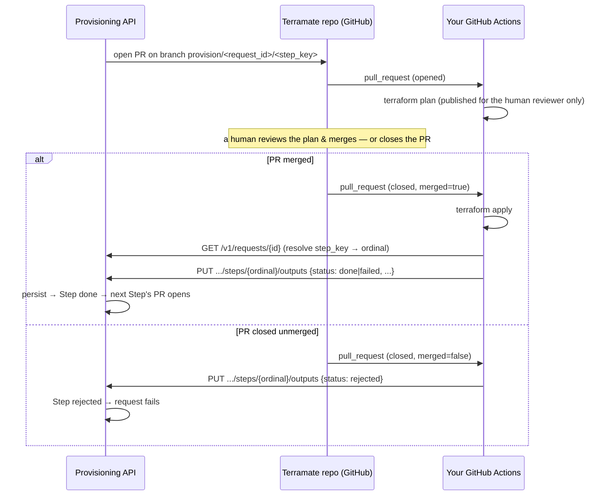

# CI integration contract — Terramate repo ↔ Provisioning API (ADR-0003/ADR-0004)

**Audience:** whoever owns the Terramate repo and writes its GitHub Actions CI.
**Purpose:** the exact, minimal contract your CI must satisfy so the provisioning
API (`terramate-api-wrapper`) can drive it end to end.
**Sibling contract:** the self-service caller's side is
[`self-service-integration.md`](self-service-integration.md).

The single most important boundary: **the provisioning API never runs Terraform,
and never polls GitHub for status.** It opens one pull request per Step and then
waits. **Your CI** runs `terraform plan`/`apply`, and **your CI reports every
terminal outcome back to the API over HTTP** (ADR-0003, ADR-0004). The API is
the sole writer of its own database — your CI needs only a scoped API
credential, never a database credential.

A working, minimal reference implementation lives in
[`fixtures/terraform-fixture-repo/`](../../fixtures/terraform-fixture-repo/) —
`.github/workflows/terraform.yml` + `scripts/report_outputs.py` (trivial
`random_id`/`local_file` Terraform, no cloud). Copy its shape.

---

## The loop



The API's only actions are the two `open PR` arrows. Everything after a PR opens
is a push **from you** (ADR-0004).

---

## 1. Branch naming (API → you)

The API opens **one PR per Step**, from a branch named exactly:

```
provision/<request_id>/<step_key>
```

- `<request_id>` — a UUID.
- `<step_key>` — e.g. `create`, `bind`.

This branch name is the **only** context your CI has about which Step it is
acting on, so parse it from the PR head ref. Bundle file edits are already
committed on the branch; the PR targets `main`.

## 2. Plan (optional — for humans, not the API)

Run `terraform plan` and surface it however your reviewers prefer (a check run,
a PR comment). **The API does not read it** — ADR-0004 removed plan polling, so
there is no required check-run name or shape. This exists purely so the human
approving the PR can see what will change.

## 3. Report the terminal outcome (the core contract)

Every Step ends in exactly one push to the API:

| Trigger | `status` to report |
|---|---|
| PR merged, `terraform apply` **succeeded** | `done` (with `outputs`) |
| PR merged, `terraform apply` **failed** | `failed` |
| PR **closed without merging** | `rejected` |

For a merged PR: check out the **merge commit**, run `terraform apply`, then
report. For a closed-unmerged PR: report `rejected` immediately (no Terraform
runs). In both cases, parse `request_id` + `step_key` from the PR head branch
and resolve `step_key → ordinal` via `GET /v1/requests/{request_id}` (the report
endpoint is ordinal-scoped).

---

## The report endpoint

```
PUT /v1/requests/{request_id}/steps/{ordinal}/outputs
Content-Type: application/json
Authorization: Bearer <token>   # see Auth below
```

**Body:**

```json
{
  "status": "done",
  "outputs": { "workspace_id": "1234567890" },
  "tf_console": "Apply complete! Resources: 1 added, 0 changed, 0 destroyed."
}
```

| Field | Meaning |
|---|---|
| `status` | **Required.** One of `done`, `failed`, `rejected`. |
| `outputs` | Apply-derived values, **keyed by the output names the Step declares** (see "Output names" below). JSON-serializable. Only meaningful for `done`; omit or send `{}` otherwise. |
| `tf_console` | Raw apply console text. Send it for `done`/`failed`; a `rejected` PR never applied, so it has none. Optional — defaults to empty. |

**Responses:**

| Status | Meaning / your action |
|---|---|
| `200` | Recorded. Body: `{ "ordinal", "key", "status" }` — the Step's resulting status. |
| `401` | No trusted forwarded identity — your auth token didn't resolve. Fix auth. |
| `403` | Identity resolved but not on the API's `CI_PRINCIPALS` allowlist. Ask the API operator to add your service principal. |
| `404` | Unknown `request_id` or `ordinal`. |
| `409` | The Step isn't in a reportable state — it has no open PR yet (`queued`). Usually means you're reporting the wrong Step. |
| `422` | `status` wasn't one of `done`/`failed`/`rejected`. |

**Idempotent:** retrying an identical report is a no-op — safe to retry on
transient network failure. A repeat report against an already-terminal Step is
accepted (`200`) but does not re-transition it.

### Output names (the coupling that matters most)

The `outputs` keys **must match the names the Step is expected to produce**, because a
later Step consumes them by reference (e.g. `${steps.create.outputs.workspace_id}`).
Each Recipe defines these. For the current `workspace` Recipe:

| Step key | Must emit outputs (on `done`) |
|---|---|
| `create` | `workspace_id` |
| `bind` | *(none)* |

If a Step reports `done` without an output that a dependent Step consumes, that
dependent Step's PR will fail to open when the API tries to resolve the missing
reference. Get the names right.

---

## Auth (M2M service principal)

The API is deployed as a **Databricks App**, behind the Databricks Apps OAuth
proxy. Your CI authenticates as a **Databricks service principal**:

1. Mint a workspace OAuth token with the SP's client-credentials grant:
   ```
   POST {DATABRICKS_HOST}/oidc/v1/token
   Authorization: Basic base64(client_id:client_secret)
   Content-Type: application/x-www-form-urlencoded
   grant_type=client_credentials&scope=all-apis
   ```
   → `access_token`.
2. Send it as `Authorization: Bearer <access_token>` on **both** the `GET` and
   the `PUT`.

The proxy authenticates the token and stamps the SP's identity onto the
`X-Forwarded-User` header before the request reaches the app; the API checks
that identity against its `CI_PRINCIPALS` allowlist. So the API operator must:

- grant your SP **can use** on the App, and
- add your SP's forwarded identity to `CI_PRINCIPALS`.

You never set `X-Forwarded-*` yourself — the proxy owns those and overwrites any
you send. Store `client_id`/`client_secret` as CI secrets.

---

## Failure semantics

- **Apply failed:** report `{"status": "failed", "tf_console": "..."}`. The Step
  moves to `failed` and the whole request fails (halt, no rollback) —
  already-done Steps stay done; nothing further is attempted.
- **PR closed unmerged:** report `{"status": "rejected"}`. The Step moves to
  `rejected` and the request fails. This push is **required** — without it the
  API cannot tell a declined PR from one whose CI simply hasn't finished, so the
  Step would sit at `submitted` until an operator intervenes (the API flags it
  `stuck` after `STEP_STUCK_THRESHOLD_SECONDS`).
- **No report at all:** the Step stays at `submitted` and is flagged `stuck`
  after the threshold, surfaced to an operator. Make sure every terminal path in
  your CI (including apply failure and close-unmerged) reports.

---

## Endpoints you use

| Method | Path | Purpose |
|---|---|---|
| `GET` | `/v1/requests/{id}` | Resolve `step_key → ordinal`; inspect Step statuses. |
| `PUT` | `/v1/requests/{id}/steps/{ordinal}/outputs` | Report the Step's terminal outcome. |

## What you must NOT rely on

The API never parses Terraform state or run logs, never polls GitHub for PR/plan
status, and never reads outcomes from anywhere but your `PUT` (ADR-0004, which
drops the status polling that the earlier design assumed; ADR-0003 already moved
output capture off the ADR-0002 direct-database write). If it isn't in your
`PUT` body, the API never sees it.
