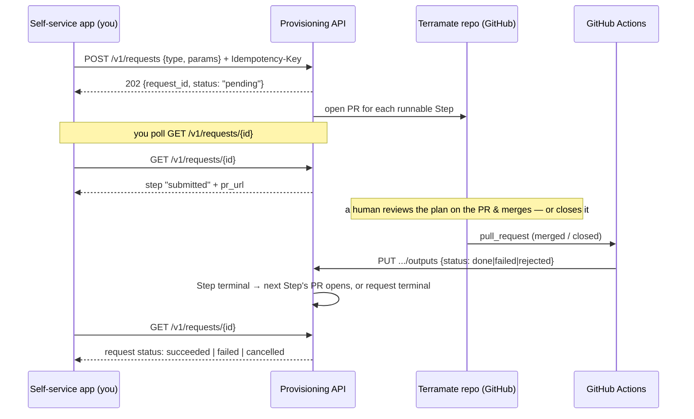

# Self-service integration contract — Self-service app ↔ Provisioning API (ADR-0004)

**Audience:** whoever owns the self-service app (SSC) that submits provisioning
requests on a user's behalf.
**Purpose:** the exact, minimal contract your app must satisfy to drive the
provisioning API (`terramate-api-wrapper`) end to end — what you send, what you
poll, and how you know a request is done.
**Sibling contract:** the CI/GitHub-Actions side is
[`ci-integration.md`](ci-integration.md).

The single most important boundary: **the provisioning API is a request intake +
status oracle, not a Terraform runner and not an approval surface.** You `POST`
one provisioning request; the API expands it into one or more ordered Steps and
opens **one GitHub PR per Step**. A **human reviews and merges (or closes) each
PR on GitHub** — that is the approval gate, and it lives entirely on GitHub, not
in this API (ADR-0004). CI reports each Step's terminal outcome back to the API.
Your app's only job after submitting is to **poll for the request's terminal
status** and point the user at the open PR when there is one to act on.

---

## The loop



Your actions are the `POST` and the polling `GET`s. Everything between "PR
opened" and "request terminal" is a human on GitHub plus a CI push — you observe
it, you don't drive it.

---

## Endpoints you use

| Method | Path | Purpose |
|---|---|---|
| `POST` | `/v1/requests` | Submit a provisioning request. |
| `GET`  | `/v1/requests/{id}` | Poll request + per-Step status (your done/not-done signal). |
| `GET`  | `/v1/requests/{id}/steps/{ordinal}` | One Step's detail (optional; the same fields the list gives). |
| `POST` | `/v1/requests/{id}/cancel` | Halt an in-flight request. |
| `GET`  | `/v1/health` | Liveness check. |

### Endpoints you must NOT call

- **`PUT /v1/requests/{id}/steps/{ordinal}/outputs`** — the CI-only outcome
  ingress. It is gated on the `CI_PRINCIPALS` allowlist; your app's principal is
  not (and must not be) on it. See [`ci-integration.md`](ci-integration.md).
- **`GET`/`POST /v1/admin/intake-gate`** — operator-only, gated on
  `ADMIN_PRINCIPALS`. Do **not** pre-check the gate before submitting; you'll get
  `403` unless your principal is an admin. Instead, just submit and treat a `503`
  on `POST /v1/requests` as "intake closed" (see below).

---

## 1. Submit a request

```
POST /v1/requests
Content-Type: application/json
Idempotency-Key: <stable client-generated key>
Authorization: Bearer <token>   # see Auth below
```

The `Idempotency-Key` header is **required**. Use a stable key per logical
request (e.g. a UUID you persist with the user's intent). A repeat `POST` with a
key already seen is a no-op that returns the **original** request's
`{request_id, status}` — safe to retry on transient network failure, and the
replay is resolved **before** the intake gate is checked (a replay of an
already-accepted request succeeds even if intake later closed).

The body is a **discriminated union on `type`** (also published live at
`/openapi.json`). Two types exist today:

### `type: "schema"` — add a schema to an existing catalog

```json
{
  "type": "schema",
  "params": {
    "catalog": "main",
    "name": "analytics",
    "owner": "data-eng@acme.com",
    "comment": "optional, may be omitted or null"
  }
}
```

| Param | Required | Meaning |
|---|---|---|
| `catalog` | yes | Existing catalog to add the schema to. |
| `name` | yes | New schema name. |
| `owner` | yes | Schema owner principal. |
| `comment` | no | Free-text comment; omit or `null` for none. |

One Step (`add-schema`), no apply-derived outputs.

### `type: "workspace"` — create a workspace and bind it to a metastore

```json
{
  "type": "workspace",
  "params": {
    "name": "team-analytics",
    "metastore": "us-east-1-metastore",
    "domain_owner": "platform@acme.com",
    "groups": ["analysts", "engineers"]
  }
}
```

| Param | Required | Meaning |
|---|---|---|
| `name` | yes | New workspace name. |
| `metastore` | yes | Metastore to bind the new workspace to. |
| `domain_owner` | yes | Owner set on the workspace during `bind`. |
| `groups` | no | Groups to grant on the binding; defaults to `[]`. |

Two ordered Steps: `create` (produces `workspace_id`), then `bind` (consumes it).
`bind`'s PR does not open until `create` is `done` — the workspace id doesn't
exist until `create` has actually applied.

### Responses

| Status | Body | Your action |
|---|---|---|
| `202` | `{ "request_id": "<uuid>", "status": "pending" }` | Persist `request_id`; start polling. |
| `401` | `{ "detail": "No resolvable caller identity" }` | Your token didn't resolve to a forwarded identity. Fix auth. **Permanent.** |
| `422` | validation error | Missing `Idempotency-Key`, unknown `type`, or bad `params`. **Permanent** — do not retry unchanged. |
| `503` | `{ "detail": "Intake is currently disabled" }` | The global intake gate is closed. **Permanent** for this attempt — surface to the user; a retry only succeeds after an operator reopens intake. |

---

## 2. Poll for status — the done/not-done contract

```
GET /v1/requests/{request_id}
```

Returns the full request with its Steps:

```json
{
  "id": "…", "type": "workspace", "params": { … },
  "version": "v1", "requester": "…",
  "status": "in_progress",
  "created_at": "…", "updated_at": "…",
  "steps": [
    {
      "ordinal": 0, "key": "create", "status": "done",
      "pr_number": 41, "pr_url": "https://github.com/…/pull/41",
      "depends_on": [], "stuck": false, "status_changed_at": "…"
    },
    {
      "ordinal": 1, "key": "bind", "status": "submitted",
      "pr_number": 42, "pr_url": "https://github.com/…/pull/42",
      "depends_on": ["…"], "stuck": false, "status_changed_at": "…"
    }
  ]
}
```

`404` if `request_id` is unknown.

### The single indicator you need: `status` at the request level

| Request `status` | Meaning | Terminal? |
|---|---|---|
| `pending` | Accepted; first PR(s) not opened yet. | no |
| `in_progress` | At least one Step is moving. | no |
| `succeeded` | **Done — all Steps applied.** | **yes** |
| `failed` | **Not done — a Step failed or its PR was rejected.** | **yes** |
| `cancelled` | **Not done — an operator/you cancelled it.** | **yes** |

**Poll `GET /v1/requests/{id}` until `status` is one of `succeeded` / `failed` /
`cancelled`.** That is your done/not-done signal — `succeeded` is done-good,
`failed`/`cancelled` are done-not-good. You do not need to read outputs; the API
does not return apply-derived values (workspace ids, etc.) on this path, by
design — the contract is completion, not values.

### Per-Step detail (for progress + the approval seam)

Each Step's `status`:

| Step `status` | Meaning |
|---|---|
| `queued` | Dependencies not yet `done`, or intake gated; no PR yet. |
| `submitted` | **PR is open — a human must review the plan and merge (approve) or close (reject) it on GitHub.** |
| `done` | Applied successfully. |
| `failed` | Applied and failed. |
| `rejected` | PR closed without merging (a human declined it). |

- **`pr_url` is your approval seam.** While a Step is `submitted`, surface its
  `pr_url` to the user: *"Review the plan and merge (or close) this PR to
  approve (or reject)."* There is **no approve-via-API** call — approval is the
  GitHub merge. `pr_url`/`pr_number` are `null` only before the PR opens
  (`queued`).
- **`stuck: true`** means the Step has sat at `submitted` past the API's
  threshold — CI's terminal push never arrived. Surface it as "waiting longer
  than expected; may need operator attention."
- `status_changed_at` is when the Step entered its current status (useful for
  "waiting since…").

---

## 3. Cancel a request

```
POST /v1/requests/{request_id}/cancel
```

| Status | Body / meaning |
|---|---|
| `200` | `{ "request_id", "status": "cancelled" }`. Already-`cancelled` returns `200` too (idempotent). |
| `409` | Request already reached a **different** terminal state (`succeeded`/`failed`) — can't be undone by cancelling. |
| `404` | Unknown `request_id`. |

Cancel stops the reconcile loop from advancing the request further; Steps that
already applied stay applied (halt, no rollback).

---

## Auth (M2M service principal)

The API is deployed as a **Databricks App**, behind the Databricks Apps OAuth
proxy. Your app authenticates as a **Databricks service principal**, exactly like
the CI side:

1. Mint a workspace OAuth token with the SP's client-credentials grant:
   ```
   POST {DATABRICKS_HOST}/oidc/v1/token
   Authorization: Basic base64(client_id:client_secret)
   Content-Type: application/x-www-form-urlencoded
   grant_type=client_credentials&scope=all-apis
   ```
   → `access_token`.
2. Send it as `Authorization: Bearer <access_token>` on every call.

The operator must grant your SP **can use** on the App. (Unlike CI, your SP does
**not** go on `CI_PRINCIPALS` — that allowlist is only for the outcome ingress
you never call.)

### Requester attribution — read this

The proxy authenticates the token and stamps the caller's identity onto
`X-Forwarded-Email` / `X-Forwarded-User` before the request reaches the app,
overwriting any such header you send. `POST /v1/requests` records that identity
as the request's `requester`.

Because you call **M2M**, the recorded `requester` is **your app's service
principal — not the human end user**. There is **no** client header to override
this (`X-Requester` is not read; the proxy owns forwarded identity). If you need
the human attributed for audit, that requires an API change on our side (an
explicit actor field in the request body), not a header — raise it with us.

`GET` and `cancel` have no app-level identity requirement beyond passing the
proxy, so any valid SP token reaches them.

---

## What changed from the earlier design (ADR-0004)

If your client was written against an earlier draft, three things are gone:

- **No plan endpoint.** `GET /v1/requests/{id}/steps/{ordinal}/plan` was
  **removed** — a call now `404`s. The API never surfaces the Terraform plan; a
  reviewer reads it on the GitHub PR. Delete any "fetch plan" call and any
  `409`-plan-pending handling. Replace that UX with the `pr_url` approval seam
  above.
- **No plan/merge Step states.** The old `pr_open` / `awaiting_approval` /
  `applying` Step statuses no longer exist. The lifecycle is
  `queued → submitted → {done|failed|rejected}` (see the table above). Any
  mapping keyed on the old states must be rewritten.
- **Outcome, not values.** Completion is expressed purely through the request/
  Step `status` fields. The read path returns no apply-derived outputs.

## What you must NOT rely on

The API never runs Terraform, never polls GitHub, never surfaces a plan, and
never returns apply-derived output values on the read path. If you need a
signal, it must be one of the `status` fields above. Approval is a human GitHub
merge, observed via `pr_url` + Step `status` — not an API action you can take.
